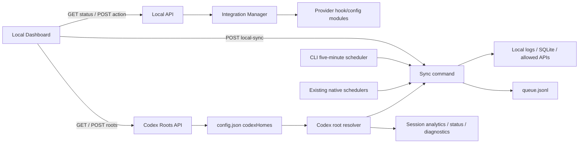

# Design: Dashboard 手动管理统计集成

## Context

当前 `cmdInit()` 通过 `runSetup()` 调用 `applyIntegrationSetup()`，一次性安装所有检测到的 Hook/插件；`cmdServe()` 在缺少 `cursors.json` 时调用 `cmdInit(["--yes"])`，并在每次启动调用 `repairRuntimeIntegrations()`。安装和卸载实现已经分散在各 provider 的 config/hook 模块中，`cmdUninstall()` 能安全识别托管内容，但只能执行全量卸载。

本地 API 已提供鉴权的 `POST /functions/tokentracker-local-sync`，Dashboard 的 Usage Overview 刷新图标已经通过 `triggerLocalSync()` 执行完整同步。macOS、Windows、Linux 原生端已有后台同步；普通 CLI `serve` 没有通用周期扫描。

Codex 主同步当前通过单值 `CODEX_HOME || ~/.codex` 解析一个本机 root，并仅在 Windows 额外 union 一个 WSL root。`parseRolloutIncremental()` 已能合并文件列表并按 `sessionUUID:eventTimestamp` 去重，`openCursorStore()` 也已经接受 `codexRoots` 数组；但 `sync.js` 只传入一个本机 root，`session-analytics.js`、`codex-context-breakdown.js`、`status.js` 和 diagnostics 仍各自解析单值 `CODEX_HOME`。因此 `.codex` 与 `.codex-ipc` 两个独立本机目录目前无法由一个常驻服务一致统计。

## Architecture

## Components

| Component | Responsibility | Change |
| --- | --- | --- |
| CLI init/serve | 启动 TokenTracker 本地运行时 | 删除自动集成安装和修复；普通 CLI 增加定时统计 |
| Integration Manager | provider 注册表、探测、单项安装和单项卸载 | 新增 |
| Local API | 为本地 Dashboard 暴露状态和受保护的集成写操作 | 新增 endpoint |
| Dashboard Settings | 展示集成状态、执行安装/卸载和立即统计 | 新增 Integrations section |
| Existing local-sync | 完整或轻量解析本地 provider 数据 | 复用，不改变协议 |
| Codex root resolver | 统一配置优先级、路径规范化、去重、探测与上限 | 新增 |
| Local config/API | 原子持久化多个 Codex roots，并保护本地路径信息 | 扩展 |
| Codex consumers | 同时扫描所有本机 roots 和允许的 WSL root | 修改 |

## Data Flow

1. `init` 只创建 TokenTracker 目录、配置、运行时和首次统计所需状态，不调用 Integration Manager 的安装方法。
2. `serve` 启动后只刷新 TokenTracker 自身运行时；普通 CLI 模式注册五分钟轻量同步，原生 shell 使用现有调度器。
3. 本地 Dashboard 查询 integrations endpoint，服务端逐项探测 provider 和托管集成状态。
4. 用户安装或卸载时，Dashboard 获取 local-auth header，API 校验 loopback Origin 和 provider/action，再串行调用目标 provider adapter。
5. 用户点击“立即统计”时复用 `triggerLocalSync()`；成功后重新读取统计和集成状态，失败时展示错误。
6. Dashboard 查询受保护的 Codex roots endpoint；服务端返回持久化 roots，或在未配置时返回 `CODEX_HOME`/默认 root 及来源。
7. 用户原子保存 roots 数组；下一次 sync、后台 child sync、session analytics、status 和 diagnostics 每次调用 resolver 获取同一有效 roots。
8. sync 对每个有效 root 扫描 `sessions/`；完整同步同时扫描 `archived_sessions/`，合并到一个 Codex 文件列表并复用现有事件级去重与 cursor store 分片。

## Technical Decisions

### Decision: 使用服务端 provider 注册表

- **Choice:** 在 `src/lib/integration-manager.js` 定义稳定 provider ID、类型、探测器、安装器和卸载器。
- **Reason:** 避免 Dashboard 知道用户文件路径或 provider 配置格式，并让 CLI uninstall 与 API 共享同一安全逻辑。
- **Alternatives:** 继续调用全量 `cmdInit`/`cmdUninstall`；无法满足单 provider 操作且容易产生额外副作用。

### Decision: 启动阶段完全不协调第三方配置

- **Choice:** `init` 和 `serve` 均不调用安装、修复或卸载 adapter。
- **Reason:** 用户要求所有 Hook 修改由 Dashboard 明确操作；状态探测是只读行为，可以在 Dashboard 请求时执行。
- **Alternatives:** 保存 desired state 并在启动时自动修复；仍然会在启动时写第三方配置，不符合目标。

### Decision: 保留原生调度并只补普通 CLI

- **Choice:** 普通 CLI 使用五分钟调度；macOS/Linux 返回不创建服务端调度，Windows 保留现有一分钟兜底以避免改变当前原生行为。
- **Reason:** 原生端已处理生命周期、睡眠唤醒和非重叠执行，统一搬迁会扩大跨平台风险。
- **Alternatives:** 全部迁移到 Node 服务；会重复或替换三个平台的成熟生命周期逻辑。

### Decision: 复用现有 local-sync API

- **Choice:** “立即统计”调用现有 `triggerLocalSync()`，不增加第二个同步 endpoint。
- **Reason:** 该接口已有鉴权、锁等待、错误码和测试；新需求只是提供更明显的入口和可见反馈。
- **Alternatives:** 新建手动统计 API；会重复同步参数和安全逻辑。

### Decision: 持久化 roots 数组并保留未配置 fallback

- **Choice:** 在 TokenTracker `config.json` 增加可选 `codexHomes: string[]`；字段不存在时继续使用 `CODEX_HOME`，否则使用 `~/.codex`。字段存在且非空时以持久化列表为扫描事实来源。
- **Reason:** 不改变现有 CLI/自动化环境的单值覆盖语义，同时让 Dashboard 配置具有确定优先级并可跨重启生效。
- **Alternatives:** 把路径列表塞入 `CODEX_HOME`；破坏上游工具对单路径变量的语义。始终把 `CODEX_HOME` 与 Dashboard 列表 union；会在升级后意外扩大用户统计范围。

### Decision: 使用统一 resolver 服务所有 Codex 读取入口

- **Choice:** 新增 `src/lib/codex-roots.js`，负责读取、校验、规范化、真实路径去重、状态探测和原子更新；sync、session analytics、context breakdown、status、diagnostics 和 API 均调用它。
- **Reason:** 避免 totals 与会话页分别扫描不同目录，并集中处理敏感路径与兼容规则。
- **Alternatives:** 只修改 `sync.js`；Dashboard totals 虽完整，但会话分析、上下文和诊断仍产生互相矛盾的结果。

### Decision: 删除 root 不撤回历史统计

- **Choice:** 从配置移除 root 只停止后续发现和解析，不改写 append-only queue、云端数据或既有 cursor history。
- **Reason:** JSONL 文件缺失无法证明用户希望删除统计，且当前队列/云协议没有按 root 可逆归属字段。
- **Alternatives:** 按 root 回滚历史；需要新增 data provenance、迁移和云端删除协议，超出本 change。

## Data and API Design

- 新增 `GET /functions/tokentracker-integrations`：返回 `{ integrations: [...] }`。
- 新增鉴权 `POST /functions/tokentracker-integrations`：请求 `{ provider, action }`，其中 `action` 为 `install|uninstall`；返回 `{ ok, integration }`。
- provider 状态字段：`id`、`label`、`kind`、`detected`、`installed`、`actionable`、`detail`、可选 `error`。
- 不新增数据库字段，不改变 queue/cursors schema，不增加环境变量。
- 新增受保护的 `GET /functions/tokentracker-codex-roots`：返回 `{ roots, configured, source, max_roots }`。
- 新增受保护的 `POST /functions/tokentracker-codex-roots`：请求 `{ roots: string[] }`，执行全量校验后原子替换 `config.json.codexHomes`。
- `roots[]` 状态字段：`path`、`origin: configured|environment|default|wsl`、`exists`、`has_sessions`、`has_archived_sessions`。
- Configuration: `~/.tokentracker/tracker/config.json` 增加可选 `codexHomes: string[]`；不改变 `CODEX_HOME`，不新增数据库或 queue/cursor schema。

## Trade-offs

| Benefit | Cost | Rationale |
| --- | --- | --- |
| 启动不再隐式修改第三方工具 | 新用户默认不是秒级更新 | 五分钟统计和立即统计保证无 Hook 可用性 |
| 每个 provider 可独立控制 | 需要统一 adapter 和更多状态测试 | 集中逻辑减少 init/uninstall 长期漂移 |
| 复用现有同步接口 | 手动按钮执行完整扫描，可能耗时 | 已有 loading、锁和超时语义可复用 |
| 一个服务统计多个独立 Codex 环境 | 每次发现阶段需要探测多个目录 | roots 上限 16，后台同步仍只扫描活跃 `sessions/` |
| 配置即时生效且保持旧环境变量兼容 | 配置优先级需要清晰约束 | 未配置时完全保留旧语义，API 显示配置来源 |

## Risks

| Risk | Impact | Mitigation |
| --- | --- | --- |
| provider adapter 操作错目标配置 | High | 白名单 provider、托管标记校验、临时 HOME 生命周期测试 |
| 并发点击导致配置竞争 | Medium | manager 对 provider 操作串行化，UI 操作期间禁用按钮 |
| 普通 CLI 定时同步与手动同步竞争 | Low | 复用现有文件锁并在调度器内阻止自身重叠 |
| OpenClaw 安装耗时或要求重启 | Medium | 返回结构化详情，保留现有安装结果语义并在 UI 显示重启提示 |
| Dashboard 托管部署误展示本地写操作 | Medium | hook 仅在 `isLocalDashboardHost()` 成功探测 endpoint 后标记可用 |
| 重复路径或符号链接导致双计数 | High | 路径规范化、existing path `realpath` 去重，并继续使用事件级 dedup |
| 任意大目录拖慢或越界扫描 | High | 拒绝文件系统根与非目录路径，仅拼接固定子目录，roots 数量上限 16 |
| 配置写入覆盖并发的其他 config 字段 | High | 读改写使用原子文件 helper，并保留未知字段；失败前不替换原文件 |
| totals、会话分析和诊断 root 集合漂移 | Medium | 所有消费者复用同一 resolver，并增加跨消费者一致性测试 |

## Rollout and Rollback

- **Rollout:** 直接切换 Hook 默认行为，不迁移和不自动删除既有 Hook；`codexHomes` 缺失时不改变扫描范围，用户首次在 Dashboard 保存后才启用多 root。既有 Hook 管理仍只针对当前进程 `CODEX_HOME`，扫描 roots 区域明确标为被动读取配置。
- **Rollback:** 删除 `codexHomes` 字段即可恢复 `CODEX_HOME -> ~/.codex` 单 root 语义；Integration Manager/API/UI 可独立移除，已统计数据保留，无需 queue 或数据库回滚。

## Open Questions

- None.
